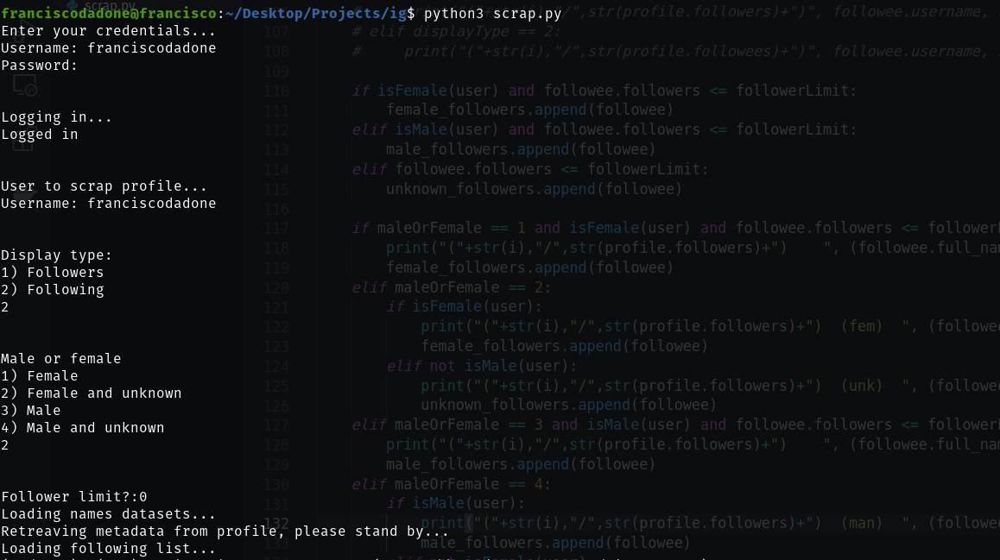

# InstagramScraper

Python app to scrape a desired instagram profile and extract the followers or followings of that person.
Then, you can choose to display the males or females and unkwnown (people that the dataset can't recognize the sex based on their name).
This works mainly with spanish names.

To install requirements, run:
```bash
pip install -r requirements.txt
```

To run the app, open a terminal and run:
```bash
python3 scrape.py
```


